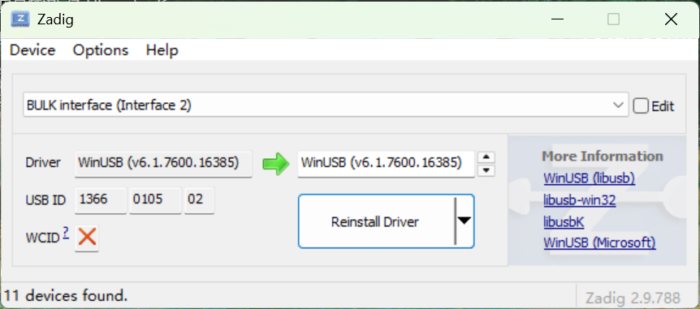
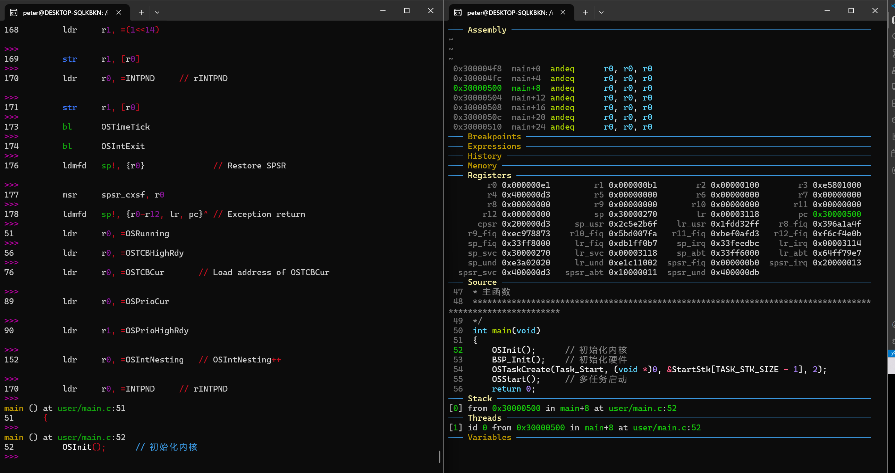

# debug 手册

## 1.环境准备
1. zadig替换jlink驱动为winUSB,一般都叫BULK interface

2. openOCD安装
3. arm-none-eabi-gdb、gdb-multiarch选择一个在wsl中apt install

## 2. 连接
1. 当前目录进入cmd：

```cmd
openocd -f DEBUG/OpenOCD/jlink.cfg -f DEBUG/OpenOCD/mini2440.cfg
```
2. 确定version
```linux
arm-none-eabi-gdb --version
//或者
gdb-multiarch --version
```

3. 进入调试
```
tty查看当前对话id
新开一个wsl终端，输入：

gdb-multiarch ./build/mini2440_rtos.elf -x init.gdb

dashboard -output /dev/pts/2  # 依据TTY值替换2
target remote localhost:3333
set architecture armv4t
monitor reset halt
monitor reset init
load
dashboard
set $pc = 0x30000000
b main
c
 
```

## 3.GDB指令集
https://quickref.cn/docs/gdb.html


## 问题记录
1. 只连jlink供电会导致电压不稳，openOCD读到的数据全为0
2. openocd ：
    Error: JTAG scan chain interrogation failed: all ones
物理问题多插拔两次jlink
