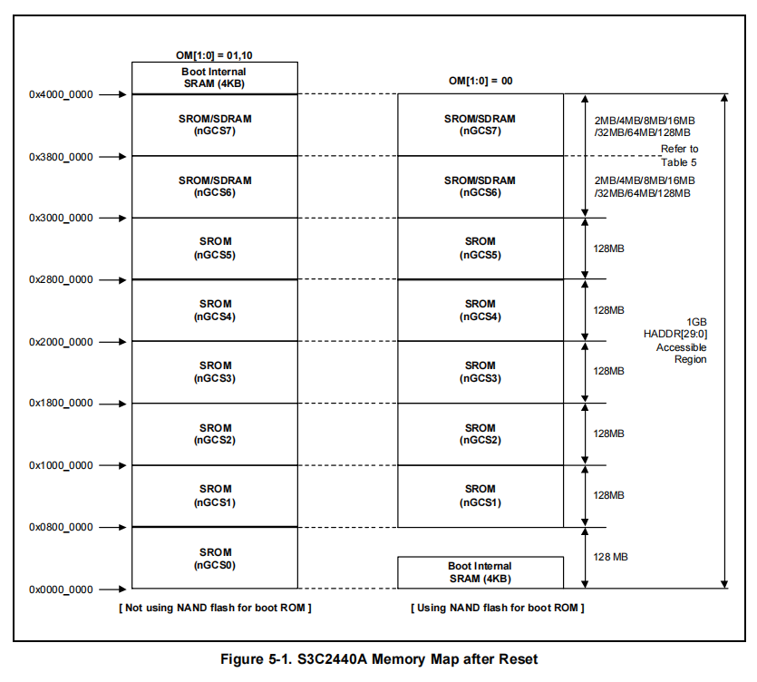
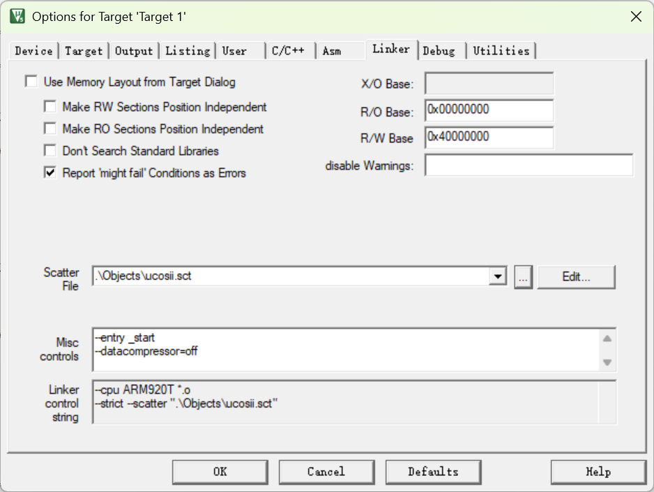
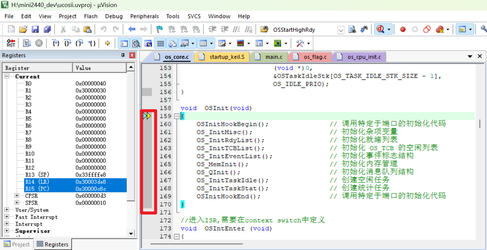

安装vscode插件Markdown All in one;Markdown Preview Github Styling

点击右上角搜索查看markdown预览


# A.因为在线仿真，keil中mini2440的内存设置太小导致程序陷入死循环

结论：不能使用在线仿真

## 1.现象：
OS_FlagInit(); 执行后直接就跳到reset handler0x00000000，陷入死循环。

    static void OS_InitEventList(void)
    {
    ...	
        OS_FlagInit(); 
    }

## 2. 可能的问题原因：
1. BSS 段重定位失败： 
在 startup.S 中，OSFlagTbl 属于 .bss 段。如果 copy_loop 搬运代码或 Zero BSS 清零逻辑执行不完整，OSFlagTbl 可能仍然指向一个无效的地址。

2. SDRAM 未初始化或访问越界： 
链接脚本link.ld将程序放在 0x30000000 (SDRAM)。如果在调用 OSFlagInit() 时，SDRAM 控制器配置错误（SMRDATA 初始化不正确），任何对 OSEventTbl 或 OSFlagTbl 的写操作都会导致 Data Abort。

3. 栈溢出： 
OSFlagInit 可能会涉及局部变量或深层调用。如果此时 SVCStack（当前处于 SVC 模式）设置的地址（0x33ff8000 附近）在物理上不可达或覆盖了代码区，会引发崩溃。

### 2.1 排查故障方法：
添加： *(volatile unsigned int *)0x30100000 = 0x12345678; //加上这行

    static void OS_InitEventList(void)
    {
    ...	
        *(volatile unsigned int *)0x30100000 = 0x12345678; //加上这行
        OS_FlagInit(); 执行后直接就跳到reset handler0x00000000
    }

### 2.2 修改后重新编译：
正常运行，说明 SDRAM 控制器（内存初始化）是成功的，且 CPU 可以正常读写外部内存。
OS_FlagInit() 处发生跳转回 0x0 的现象，通常是因为程序触发了 Data Abort（数据中止） 异常，而异常向量表处理不当或未正确跳转。问题核心极大概率在于 BSS 段（未初始化全局变量）的地址映射或初始化。

## 3. 根本原因：栈溢出 (Data Abort)
在 OS_FlagInit() 中，uC/OS-II 会遍历并初始化 OSFlagTbl。

SCT 文件冲突：根据ucosii.sct：

    LR_ROM1 0x00000000 0x00200000  {
    ER_ROM1 0x00000000 0x00200000  {
    startup_keil.o (*, +First)    ; 
    (*, +First)
    *(InRoot$$Sections)
    .ANY (+RO)
    .ANY (+XO)
    }
    RW_RAM1 0x30000000 0x04000000  {  ; 保持原设计: SDRAM 主数据区
    .ANY (+RW +ZI)
    }
    RW_IRAM1 0x40000000 0x00001000  {  ; 保持原设计: 内部 SRAM（可选）
    }
    }

RW_RAM1（存放 +RW 和 +ZI，即 BSS 段）被显式指定在 0x40000000。

关键点：0x40000000 是 S3C2440 的 内部 SRAM (Steppingstone)，其大小通常只有 4KB。

栈溢出：如果 OS_MAX_FLAGS（在 os_cfg.h 中定义）较多，OSFlagTbl 的大小加上其他全局变量可能会迅速超过 4KB。一旦 OS_FlagInit() 尝试写入超过 4KB 的地址（例如 0x40001000），CPU 会立即触发 Data Abort 异常。

为何回到 Reset：在 ARMv4 架构中，Data Abort 向量位于 0x00000010。查看./build/mini2440_rtos.dis：

地址 0x00000010 处的指令是 B 0x0000002C。

如果 0x0000002C 处的处理逻辑最终引导回了 reset 或者触发了看门狗重启，现象就是跳回 0x0。

        43:         B       Abort_Handler 
    0x00000010  EA000005  B         0x0000002C

        56: FIQ_Handler 
    0x0000002C  EAFFFFFE  B         0x0000002C
### 3.1 测试OSFlagTbl边界
现在在OSFlagInit();前面加入以下两行：

    *(volatile unsigned int *)0x40000000 = 0xAA; // 应该成功

    *(volatile unsigned int *)0x40001000 = 0xBB; // 极大概率会导致重启
即：

    static void OS_InitEventList(void)
    {
    ...	
        *(volatile unsigned int *)0x40000000 = 0xAA; // 应该成功
        *(volatile unsigned int *)0x40001000 = 0xBB; // 极大概率会导致重启
        *(volatile unsigned int *)0x30100000 = 0x12345678; //加上这行
        OS_FlagInit(); 执行后直接就跳到reset handler0x00000000
    }

不出意外，0xBB导致reset，0xAA能让程序正常运行。

## 4. 第2次debug

既然测试结果与预期完全一致（写 `0x40001000` 导致重启），那么问题的根源已经锁定：全局变量（ZI/BSS段）被分配到了空间极其有限的内部 SRAM (Internal SRAM)在bank0-7之外，导致 `OS_FlagInit()` 在初始化时发生了内存访问越界（Data Abort）。



### 4.1 故障原因

* 内部 SRAM 的限制：S3C2440 的内部 SRAM（Steppingstone）在启动后映射在 `0x40000000`，但其物理大小仅有 4KB（即 `0x40000000` 到 `0x40000FFF`）。
* 越界触发异常：当尝试写入 `0x40001000` 时，由于该地址没有物理内存对应，CPU 硬件会立即触发 Data Abort 异常。
* 跳转回 0x0 的原因：
* 根据内存镜像，`0x00000010`（Data Abort 向量地址）处是一条跳转指令 `B 0x0000002C`。
* 在 `startup_keil.S` 的异常处理中，虽然定义了 `Abort_Handler`，但如果向量表设置不当，或者在异常处理中发生了二次崩溃，系统通常会由于看门狗复位或逻辑跳转回到 `Reset_Handler`。


* OS_FlagInit 的行为：尽管 `OS_MAX_FLAGS` 只有 5，但 uC/OS-II 的全局变量是连续排列的。`OSFlagTbl` 可能恰好被分配在了 4KB 空间的末尾，或者它之前的变量已经占据了大部分空间，导致 `OS_FlagInit()` 循环初始化的地址跨过了 `0x40001000` 这一红线。

### 4.2 解决方案：修正分散加载文件 (`ucosii.sct`)

必须将 `RW`（已初始化变量）和 `ZI`（未初始化变量/BSS）从内部 SRAM 挪到容量巨大的 SDRAM (0x30000000) 中。

修改的 `ucosii.sct` 文件如下：

```
LR_ROM1 0x00000000 0x00200000  {    ; 加载域：Nor Flash
  ER_ROM1 0x00000000 0x00200000  {  ; 执行域：代码在 0x0 运行（或根据需要设为 0x30000000）
   startup_keil.o (STARTUP, +First) ; 确保启动代码在最前面
   *(InRoot$$Sections)
   .ANY (+RO)
  }

  ; 核心修改：将所有数据段和 BSS 段移至 SDRAM
  ; 0x30100000 是为了避开程序代码区（0x30000000开始的一段）
  RW_RAM1 0x30100000 0x03F00000  {  
   .ANY (+RW +ZI)
  }

  ; 内部 SRAM 仅用于临时变量或特殊加速需求，不要放全局变量表
  RW_IRAM1 0x40000000 0x00001000  {
  }
}

```

### 4.3 验证步骤

1. 修改并重新编译：保存 `.sct` 文件并重新 Build 工程。
2. 查看 Map 文件：打开 `Listings/ucosii.map`，搜索 `OSFlagTbl`。
* 确认地址：它现在的地址应该是 `0x301XXXXX`，而不是 `0x400XXXXX`。
* 已确认：`OSFlagTbl 0x30100d14 Data 60 os.o(.bss)`
3. 运行调试：再次执行程序，`OS_FlagInit()` 应该能平滑通过，因为它现在是在 64MB 的 SDRAM 空间内操作，不再有 4KB 的地址屏障。

### 4.4 逻辑补强

检查在 `startup_keil.S` 中设置的栈地址（如 `SVCStack EQU 0x33FEEC00`）也位于 SDRAM 范围内。由于设置的栈地址已经在 `0x33FF0000` 附近，这部分是安全的，不会触发 4KB 越界问题。

**注意，如果修改`startup_keil.S`那么`startup.S`也要修改。**

## 4.5 清场
删除调试代码

    static void OS_InitEventList(void)
    {
    ...	
        *(volatile unsigned int *)0x40000000 = 0xAA; // 应该成功
        *(volatile unsigned int *)0x40001000 = 0xBB; // 极大概率会导致重启
        *(volatile unsigned int *)0x30100000 = 0x12345678; //加上这行
        OS_FlagInit(); 执行后直接就跳到reset handler0x00000000
    }
=>

    static void OS_InitEventList(void)
    {
    ...	
        OS_FlagInit(); 执行后直接就跳到reset handler0x00000000
    }
编译运行，依然reset。

## 5. 第3次排查问题
现在的原因应该是`startup_keil.S`没有初始化好`0x301XXXXX`后面的内存导致的。
根据Map 文件信息，`OSFlagTbl` 的地址位于 **`0x30100d14`**。这是一个非常关键的信号，它排除了之前关于“4KB 内部 SRAM 越界”的猜想，因为这个地址确实位于 64MB 的 **SDRAM 范围内**。

即便地址合法，程序依然在执行 `OS_FlagInit()` 后跳回 Reset，这说明 **Data Abort** 依然发生了，但原因转向了**内存访问的有效性**或**代码逻辑执行的异常**。按照以下调试思路排查：

1. 验证 SDRAM 连续读写的稳定性

    虽然之前单次写入 `0x30100000` 成功，但 `OS_FlagInit()` 是一个**循环写入**过程。如果 SDRAM 的刷新频率（Refresh Rate）或配置参数不稳，连续写入会导致总线锁死或数据校验错误。

* **实验**：在 `OS_InitEventList()` 之前，手动写一个等效的循环：
```
// 模拟 OS_FlagInit 的写入逻辑
unsigned int *p = (unsigned int *)0x30100d14;
for(int i = 0; i < 15; i++) { // 60字节约为15个int
    p[i] = 0; 
}

```
* **如果这几行执行也导致重启**：说明 `startup_keil.S` 中的 `SDRAM Initialization` 部分（`REFRESH`, `BANKCON6` 等寄存器值）虽然让内存“动”起来了，但**参数不准**，无法支撑连续读写。

* **正常运行**

2. 检查 BSS 段是否真的被正确“清零”

    在 `arch copy/startup_keil.S` 中， `CodeInSDRAM` 之后似乎**缺失了清零 BSS 段的汇编逻辑**。

* **风险点**：uC/OS-II 依赖全局变量初始化为 0。如果 BSS 段没有清零，`OSEventFreeList` 或 `OSFlagFreeList` 可能包含随机的脏数据（垃圾值）。
* **后果**：当 `OS_FlagInit()` 尝试将 `pgrp->OSFlagWaitList = (void *)&OSFlagTbl[i + 1]` 这种链表指针写入内存时，如果读取到的初始指针是非法的，或者后续代码尝试访问这些脏指针，就会崩溃。
* **修复**：确保启动代码中有 `Zero BSS` 逻辑，或者在 `main` 的最开始手动调用 `memset` 清除从 `0x30100000` 开始的数据区。

3. 向量表未重映射

* **现象**：崩溃后跳回 `0x0`。
* **原因**：S3C2440 触发异常时，CPU 总是强制跳转到硬件地址 **`0x00000010`**。
* **问题**：由于在 Keil 里是调试模式，如果向量表（Vector Table）只存在于 SDRAM (`0x30000000`)，而物理 `0x0` 地址处没有代码或代码不正确，CPU 在跳到 `0x10` 时会读取到错误的指令，从而表现为随机重启。
* **解决**：检查 `startup_keil.S`。虽然有一段 `VecLoop` 尝试安装向量表，但要确认它是否真的写到了物理 `0x0`（如果是 NOR 启动，物理 `0x0` 是无法直接通过 `STR` 指令写入的）。


4. 栈指针 (SP) 冲突

在 Map 文件中，查看 **`SVCStack`** 的最终分配位置。

* 如果在 `OS_FlagInit()` 内部发生了函数调用，而此时的栈指针 `SP` 指向的地址与data区（`0x30100d14`）发生了**重叠**，那么初始化 `OSFlagTbl` 的过程会亲手破坏掉程序运行所需的栈空间，导致函数返回时 `PC` 载入了一个非法地址，直接飞到 `0x0`。

### 5.1  `}`崩溃之谜

根据调试现象，我们可以非常精确地锁定问题。这不仅仅是一个内存地址的问题，而是一个典型的**栈溢出（Stack Overflow）或栈空间冲突**导致的系统崩溃。

以下是针对五个现象的深度分析和解决方案：

#### 1. 为什么执行完 `}` 就 Reset？

* **现象描述**：执行到 `LDMIA R13!, {R4-R6, R14}` 后崩溃。这条指令的作用是从栈（`R13/SP`）中恢复寄存器，并把之前保存的返回地址弹出到 `R14 (LR)`。
* **崩溃原因**：在执行 `OS_FlagInit()` 的过程中，由于某种原因，**当前函数的栈空间被破坏了**。当函数运行到 `}` 准备返回时，它从栈里弹出的返回地址已经变成了非法值或 `0x00000000`。于是 CPU 执行跳转，直接“飞”回了 Reset 向量。

#### 2. 为什么数据写到 `0x30100d38` 就停止了？

* **现象描述**：`OSFlagTbl` 起始于 `0x30100d14`，写入到 `0x30100d38` 停止，后面全是 0。
* **计算**：`0x30100d38` - `0x30100d14` = `0x24`（36字节）。`OS_MAX_FLAGS` 是 5，每个 `OS_FLAG_GRP` 结构体的大小通常是 12 或更多字节。
* **结论**：写入停止说明 `OS_FlagInit()` 内部的循环可能因为读取到非零的“脏数据”而提前终止，或者在写入过程中触发了数据中止（Data Abort），导致循环没跑完就跳出了。

#### 3. 没有 BSS 清零逻辑的严重后果

* **危害**：uC/OS-II 极度依赖 BSS 段（全局变量区）初始为 0。
* **本案例影响**：因为没有清零 BSS，`OSFlagTbl` 里面的数据是随机的。`OS_FlagInit` 可能会错误地认为某些标志位已经被使用，或者在操作链表指针时引用了随机地址，导致写入操作覆盖了**当前的栈空间**。

#### 4. 解决方案：必须执行的两步操作

##### 第一步：在 `startup_keil.S` 中加入 BSS 清零 (核心修复)

即使编译器指定了地址，硬件上电后 SDRAM 里的内容是随机的。必须手动清零。在 `CodeInSDRAM` 标签后加入以下代码：

```armasm
; ========================================================
; Zero BSS Section
; ========================================================
        IMPORT  |Image$$RW_RAM1$$ZI$$Base|
        IMPORT  |Image$$RW_RAM1$$ZI$$Limit|
        
        LDR     R0, =|Image$$RW_RAM1$$ZI$$Base|
        LDR     R1, =|Image$$RW_RAM1$$ZI$$Limit|
        MOV     R2, #0
ZeroBSS
        CMP     R0, R1
        STRCC   R2, [R0], #4
        BCC     ZeroBSS

```

*注：这里的 `RW_RAM1` 对应 `ucosii.sct` 中定义的执行域名称。*

##### 第二步：检查栈指针 (SP) 的位置

设置的 `SVCStack` 为 `0x33FEEC00`。请检查：

1. **Map 文件**：确认 `RW_RAM1` 的结尾地址没有增长到 `0x33FE0000` 附近。
   ```bash
   Execution Region RW_RAM1 (Exec base: 0x30100000, Load base: 0x00003e90, Size: 0x00003934, Max: 0x03f00000, ABSOLUTE, COMPRESSED[0x00000028])
   ```
2. **SP 冲突测试**：如果清零 BSS 后依然崩溃，尝试在 `OS_FlagInit` 之前打印或查看 `SP` 寄存器的值。如果 `SP` 的值离 `0x30100D14` 很近，说明**全局变量把栈给杀掉了**。
    ```bash
    }前后，SP发生了突变，值从0x33FEEBE0=>0x33FEEBF0,说明发生了栈污染。
    ```

#### 5. 如何确认是栈被破坏？

在 Keil 调试状态下：

1. 单步运行到 `OS_FlagInit();` 这一行，**不要跳入**。
2. 记录此时寄存器窗口中 `R13 (SP)` 指向的内存地址的值（即栈顶存储的返回地址）。
3. 单步跳过 `OS_FlagInit();`。
4. 检查刚才记录的内存地址。如果那个位置的值变了，说明 `OS_FlagInit` 发生了**写越界**，把返回地址给覆盖了。

## 6. 第4次debug

问题的真相已经大白：**程序在执行 `OS_FlagInit()` 时发生了栈污染，而这种污染是由“缺失 BSS 清零”和“ARM 编译器压缩（Compression）机制”共同导致的。**

以下是深度解析：

### 1. 为什么 SP 会“突变”？

* **SP 的变化**：从 `0x33FEEBE0` 变为 `0x33FEEBF0`（增加了 16 字节）。
* **逻辑分析**：在汇编指令 `LDMIA R13!, {R4-R6, R14}` 中，`!` 表示回写。由于弹出了 4 个寄存器（R4, R5, R6, LR），SP 理应增加4*4 =16字节。
* **致命点**：SP 的增加是正常的汇编行为，但 **Reset 的原因**是：在 `LDMIA` 执行时，从栈地址 `0x33FEEBD0` 附近弹出的 **R14 (返回地址)** 已经被改写成了 `0x00000000`。
* **结论**：函数试图返回到“空地址”，直接触发了硬件复位。

### 2. 深度原因：COMPRESSED [0x00000028] 的陷阱

SCT 运行信息中：
`RW_RAM1 ... Size: 0x00003934, ... COMPRESSED[0x00000028]`

* **压缩机制**：Keil 的 ARM 链接器为了节省 Flash 空间，会将 RW/ZI 数据进行压缩处理。
* **解压依赖**：这种压缩数据必须由 Keil 的标准库初始化代码（`__main` 中的 `__rt_entry`）进行解压。
* **现状**：使用了自定义的 `startup_keil.S` 并在结尾直接 `BL main`，跳过了 Keil 标准库的初始化过程。
* **后果**：
1. **数据全是乱码**：SDRAM 中的 `OSFlagTbl` 区域此时全是压缩后的密文或随机脏数据。
2. **指针满天飞**：`OS_FlagInit()` 读到了错误的“脏指针”，在初始化链表时，将数据写到了当前的栈区（`0x33FEEBxx`），亲手覆盖了函数的返回地址。


### 3. 解决方案

#### 禁用链接器压缩

由于不使用标准库启动，必须告诉链接器不要压缩数据，否则看到的内存全是乱码。

在 Keil 的 **Linker** 选项卡的 **Misc Controls**中加入：
`--datacompressor=off`


#### 检查 `OS_FlagInit` 内部地址

* **确保没有重叠**：查看 Map 文件，确保 `RW_RAM1` 的结尾地址（`0x30100000 + 0x3934` 左右）离栈区 `0x33FE0000` 足够远。
## 7. 第5次debug：Keil仿真器SDRAM配置问题

### 7.1 现象
禁用压缩并添加BSS清零后，在**真实硬件（Mini2440板子）上程序正常运行**，但在**Keil模拟器中仍然Reset**。

### 7.2 调试过程与发现

#### 现象细节
1. **SP地址正常**：执行 `STMDB R13!, {R4-R6, R14}` 前后，SP从 `0x33FFFFE0` 正确降到 `0x33FFFFD0`
2. **LR寄存器正常**：执行PUSH后，LR寄存器值为 `0x00000CCC`（OSInit的返回地址）
3. **栈内存读回为0**：在Memory窗口查看 `0x33FFFFDC`（LR保存位置），读回值全是 `0x00000000`
4. **LDMIA后LR变0**：执行 `LDMIA R13!, {R4-R6, R14}` 后，LR从 `0x00000CCC` 变成 `0x00000000`

#### 关键线索
- 写入栈地址 `0x33FFFFDC` 的数据无法被正确读回
- 说明**该地址范围不可写或不存在**

### 7.3 根本原因：Keil仿真器未配置SDRAM

**问题定位**：
- Mini2440板载128MB SDRAM（地址范围：`0x30000000` ~ `0x37FFFFFF`）
- SVC栈设置在 `0x33FFFFF0`（假定64MB以上SDRAM可用）
- **Keil模拟器默认只模拟片上SRAM**，不包含外部SDRAM映射
- 当程序尝试写 `0x33FFxxxx` 时，仿真器没有该地址空间，写入失败但不报错
- 函数返回时从栈读到全0的LR，跳转到 `0x00000000` 触发Reset

### 7.4 解决方案

#### 方案1：配置Keil仿真器内存映射（推荐用于学习调试）

1. **打开Debug配置**：
   - `Project → Options for Target → Debug`
   - 在右侧Settings按钮（仿真器名称旁）

2. **添加SDRAM映射（Simulator模式）**：
   - 进入 **Memory Map** 标签页
   - 点击 **New** 添加：
     - Start: `0x30000000`
     - Size: `0x08000000`（128 MB）
     - Type: **Read/Write**

3. **配置初始化文件（JLINK模式）**：
   - 在 **Initialization File** 中指定 `.ini` 文件路径
   - 确保脚本包含SDRAM控制器初始化（BWSCON、BANKCON6等寄存器配置）

#### 方案2：临时调整栈地址（仅用于仿真验证）

修改 `arch copy/startup_keil.S` 中的栈定义：
```assembly
; 原定义（需要64MB以上SDRAM）
; SVCStack  EQU  0x33FFFFF0

; 临时调整到SDRAM起始区域（确保仿真器能访问）
SVCStack  EQU  0x30100000  ; 放在data段起始1MB处
```
**注意**：此方法仅用于临时验证问题，实际部署时应使用方案1的正确配置。

#### 方案3：直接使用硬件调试（生产环境推荐）

既然板子能正常运行，直接使用JLINK进行硬件调试：
- 避免模拟器对外设/SDRAM支持不完整的问题
- 获得真实硬件的时序和行为
- 调试效率更高

### 7.5 验证方法

配置完成后，在Memory窗口测试：
1. 输入地址 `0x33FFFFF0`
2. 手动写入测试值 `0x12345678`
3. 读回验证是否一致
   - **成功**：仿真器配置正确
   - **失败**：检查Memory Map配置或切换到硬件调试

### 7.6 经验总结

**教训**：
- Keil模拟器**不会自动映射外部存储器**（SDRAM/SRAM/Flash）
- 任何超出片上资源的地址访问都会静默失败（读回0，写入丢失）
- 症状表现为"栈损坏"或"返回地址丢失"，但实际是**内存映射缺失**

**最佳实践**：
- 开发阶段：配置完整的仿真器内存映射，确保调试环境与硬件一致
- 生产阶段：优先使用JLINK等硬件调试器，避免模拟器的局限性
- 在startup代码中预留SDRAM测试代码，验证物理内存可用性

**关键检查点**：
- 如果程序在板子上能跑但仿真器不行 → 检查仿真器内存配置
- 如果写入SDRAM高地址段失败 → 确认板载容量与代码假设一致
- 如果栈指针超出实际SDRAM范围 → 调整SVCStack定义或增加板载内存

---

# B. 调试器侧边栏灰色问题

结论：


## 1. 现象
连接J-Link调试Mini2440开发板时，Keil µVision编辑器中**行号左侧的侧边栏显示为灰色而非绿色**，但使用模拟器仿真时侧边栏正常显示绿色。

**关键观察**：
- 程序能正常运行，PC值正确（如 `0x30003030`）
- Disassembly窗口能正常显示汇编代码
- Call Stack正常显示函数调用
- **能够设置断点并正常断住**
- 单步执行（F10/F11）功能正常

## 2. 排查过程

### 2.1 初步猜测：断点配置问题
**尝试方案**：
- 修改 `JLinkArm_Target 1.ini`：
  - `EnableFlashBP = 0`（禁用Flash断点）
  - `EnableFlashDL = 0`（禁用Flash下载）
- 修改 `ucosii.uvopt` 中的J-Link参数：
  - `-O302` → `-O78/-O14`（禁用Flash相关标志）
  - `-Z0` → `-Z1`（启用RAM软件断点）

**结果**：侧边栏仍然灰色

### 2.2 怀疑：编译优化级别问题
**尝试方案**：
- 将 `<Optim>` 从 1 改为 0（无优化）
- 从GUI检查发现Compiler control string显示 `-O2 -apcs=interwork`
- 禁用 `<interw>`（ARM/Thumb Interworking）

**结果**：侧边栏仍然灰色

**困惑点**：XML中设置Optim=0，但GUI显示实际使用-O2

### 2.3 怀疑：内存映射不匹配
**尝试方案**：
1. 修改 `ucosii.uvproj` 中的IRAM配置：
   - 从 `0x40000000`（4KB片上SRAM）改为 `0x30000000`（64MB SDRAM）
2. 修改链接器地址范围：
   - `<TextAddressRange>` 从 `0x00000000` 改为 `0x30000000`
   - `<DataAddressRange>` 从 `0x40000000` 改为 `0x30000000`
3. 在 `Ext_RAM.ini` 中添加内存映射命令：
   ```
   MAP 0x30000000, 0x34000000 READ WRITE EXEC
   ```

**结果**：Keil会在重新打开项目时覆盖XML修改，侧边栏仍然灰色

### 2.4 尝试清理缓存
**尝试方案**：
- 删除 `*.uvgui*` 文件（界面布局缓存）
- 删除 `*.bak` 文件

**结果**：侧边栏仍然灰色

### 2.5 Command窗口调试
**尝试命令**：
- `UNASSEMBLE 0x30000000` → `*** error 34: undefined identifier`
- `LOAD \\.\Objects\ucosii.axf /NOCODE` → `*** error 56: cannot open file`
- `BS *` → `*** error 10: Syntax error`
- `BP \main.c\52` → `*** error 34: undefined identifier`

**发现**：命令语法与标准文档不符

## 3. 最终验证

通过Keil的**Breakpoints窗口**（Ctrl+B）手动设置断点：
- **能够成功设置断点**
- **断点能正常命中**
- **单步执行完全正常**
- **所有调试功能正常工作**

## 4. 结论

**侧边栏灰色只是Keil的显示Bug，不影响任何实际调试功能。**

### 4.1 灰色侧边栏的含义
- **绿色（正常）**：Keil确认该行有对应的可执行代码，可设置断点
- **灰色**：Keil认为该行无对应的可执行代码或无法确定映射关系

### 4.2 可能原因
1. **J-Link外部调试器状态同步问题**：Keil与J-Link之间的调试信息同步延迟或不完整
2. **Keil版本显示Bug**：特定版本的Keil在处理外部SDRAM调试时的界面渲染问题
3. **调试会话状态缓存**：界面状态与实际调试会话不同步

### 4.3 对比分析
| 调试方式 | 侧边栏颜色 | 功能状态 | 原因分析 |
|---------|----------|---------|---------|
| 模拟器仿真 | 绿色 | 正常 | 直接使用.axf文件，映射关系明确 |
| J-Link硬件调试 | 灰色 | 正常 | 通过外部调试器，Keil无法实时确认代码加载状态 |

## 5. 最佳实践建议

### 5.1 可以忽略此问题
- 只要断点能设置、能命中，灰色显示不影响开发
- 重点关注程序逻辑和功能实现

### 5.2 避坑指南
- 必须通过GUI的Options对话框修改配置
- 删除缓存文件uvgui后必须完全退出Keil再重新打开，也能解决调试时keil软件卡顿的问题

## 6. 工作总结

**耗时**：多轮调试，尝试了10+种配置修改方案

**吐槽**：
- Keil的配置系统过于复杂，XML和GUI不同步
- 命令窗口语法与文档严重不符
- 显示Bug浪费了大量调试时间
- 最终发现只是个不影响功能的界面显示问题


# C.make时报错：clock skew

解决：wsl命令行全部touch一遍，并且检查目录是否存在空格标点符号等非法命名。

    find ./ -type f |xargs touch

